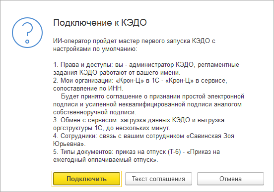
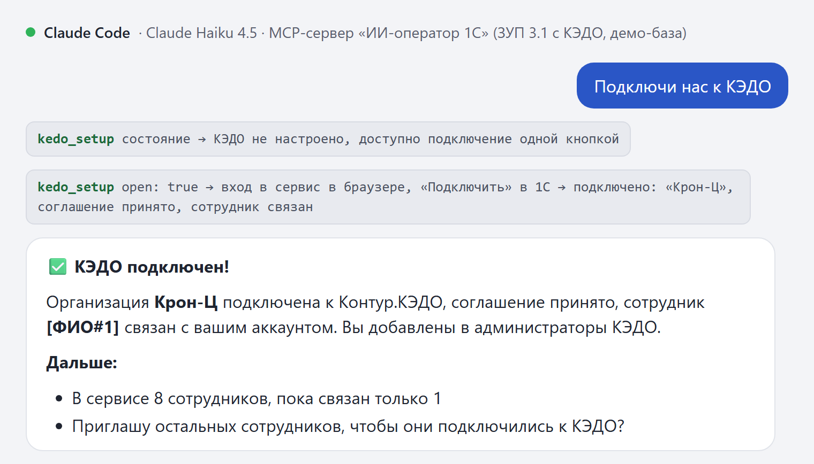
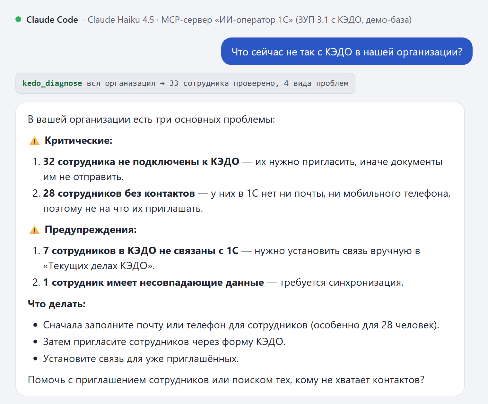
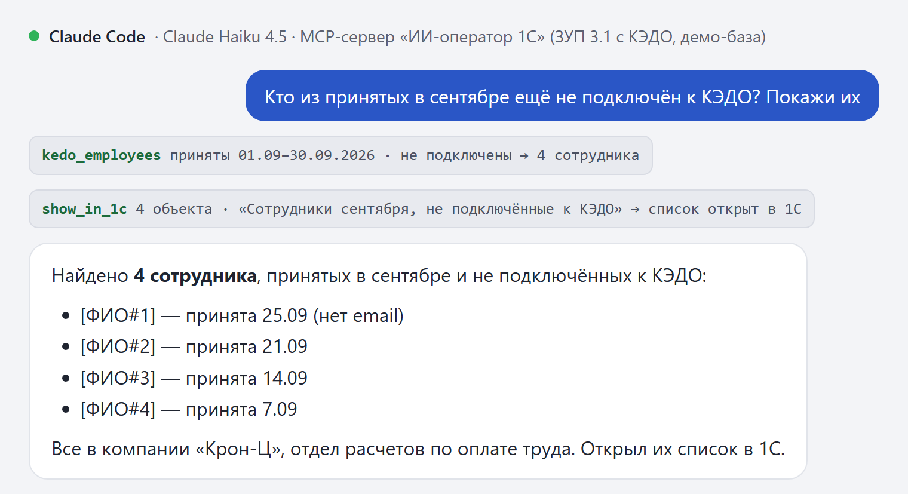
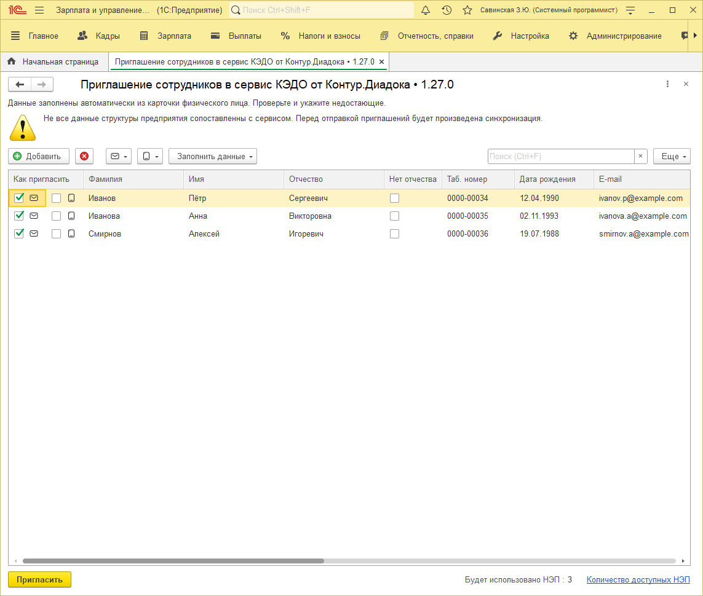

<p align="center"></p>

# ИИ-оператор: надстройка для кадрового ЭДО

**Пакет ИИ-оператора для «1С:Зарплата и управление персоналом 3.1» с расширением Контур.КЭДО.** Кадровик пишет в чат с моделью обычными словами, модель отвечает по данным КЭДО в базе и открывает его штатные формы уже заполненными. Всё, что уходит сотрудникам, отправляет человек кнопкой в форме.

[](LICENSE)


<a href="https://infostart.ru/1c/articles/2806328/"></a>

О надстройке на Инфостарте: [ИИ-оператор управляет КЭДО](https://infostart.ru/1c/articles/2806328/).

<p align="center"><a href="https://infostart.ru/1c/articles/2806328/"></a></p>

[ИИ-оператор](https://github.com/RunetX/ai-operator-core) — MCP-сервер внутри сеанса 1С пользователя: модель работает с правами этого пользователя и только через инструменты. Надстройка добавляет к нему инструменты кадрового ЭДО.

---

## Содержание

- [Как это выглядит](#как-это-выглядит)
- [Как устроено](#как-устроено)
- [Инструменты](#инструменты)
- [Что нужно](#что-нужно)
- [Установка](#установка)
- [Тесты](#тесты)
- [Ограничения](#ограничения)
- [Лицензия](#лицензия)

---

## Как это выглядит

Диалоги ниже — Claude Code с моделью Claude Haiku 4.5 на демо-базе ЗУП; ФИО вымышленные. Вместо имён модель получает токены `[ФИО#n]`.

**«Подключи нас к КЭДО».** Пользователь входит в сервис в браузере, а в 1С видит план подключения и нажимает «Подключить». Шаги мастера первого запуска надстройка проходит сама.





**«Что сейчас не так с КЭДО в нашей организации?»** Диагностика по всей организации: что мешает, у скольких сотрудников и как это исправить штатно.



**«Кто из принятых в сентябре ещё не подключён к КЭДО? Покажи их».** Модель находит сотрудников и открывает их список в 1С.



**«Пригласи тех, у кого есть почта».** Открывается штатная форма КЭДО, уже заполненная. «Пригласить» нажимает кадровик.



---

## Как устроено

- **Поверх расширения КЭДО.** Надстройка читает справочники и регистры поставляемого расширения Контур.КЭДО и открывает его формы: «Приглашение сотрудников», «Отправка на ознакомление», мастер первого запуска. В сервис КЭДО она сама не обращается: вход, проверки, лицензии и отправка остаются за расширением КЭДО. В надстройке только общие модули, два макета и служебная подсистема; объекты ЗУП и КЭДО она не заимствует и не меняет.
- **Подключение одной кнопкой.** На просьбу «подключи нас к КЭДО» надстройка проходит мастер первого запуска КЭДО 1.27 за пользователя. Он входит в сервис в браузере и нажимает «Подключить» в вопросе с планом. Дальше надстройка вызывает функции мастера с его умолчаниями: добавляет пользователя в «Администраторы КЭДО», принимает соглашение и сопоставляет организации по ИНН, запускает первый обмен, связывает пользователя с его сотрудником и заполняет типы документов. Ход виден в окне ожидания по шагам мастера. В КЭДО до 1.27 и по просьбе пользователя открывается сам мастер.
- **Итог — по данным, а не со слов модели.** Формы КЭДО ничего не возвращают, поэтому после закрытия формы надстройка читает состояние в базе: кого пригласили, кому ушло ознакомление или что форму закрыли без отправки. Это и получает модель.
- **Персональные данные не уходят модели.** ФИО, почта, телефоны и даты рождения сотрудников ядро ИИ-оператора заменяет токенами вида `[ФИО#3]`. Какие поля объектов КЭДО маскировать, задаёт макет `ИИОК_ПреднастройкаМаскирования`. Имя сотрудника видит только человек в 1С.
- **Без настройки под процесс компании.** Инструменты отдают состояния продукта: статусы сотрудников и документов, причины сбоев. Порядок действий модель собирает в диалоге.

## Инструменты

| Инструмент | Что делает | Кто меняет данные |
| --- | --- | --- |
| `kedo_employees` | Сотрудники организаций КЭДО со статусом подключения: не подключён, приглашён, приглашение просрочено, подключён. Отбор по дате приёма, статусу и организации | — |
| `kedo_documents` | Локальные нормативные акты (ЛНА) со статусом и ходом ознакомления: кто ознакомлен, кто нет, кто отказался | — |
| `kedo_diagnose` | Почему КЭДО не работает у сотрудника или в организации: причина, важность и штатное исправление | — |
| `kedo_setup` | Настроено ли КЭДО; подключает его одной кнопкой (КЭДО 1.27 и новее) или открывает мастер первого запуска | пользователь: вход в сервис и «Подключить» или кнопки мастера |
| `kedo_invite` | Открывает «Приглашение сотрудников» с выбранными сотрудниками | пользователь кнопкой «Пригласить» |
| `kedo_familiarize` | Открывает «Отправку на ознакомление» утверждённого ЛНА с выбранными сотрудниками | пользователь кнопкой «Отправить на ознакомление» |

`kedo_invite` и `kedo_familiarize` по умолчанию запрещены. Администратор разрешает их пользователям или группам в регистре «Разрешения действий ИИ-оператора» (раздел «ИИ-оператор»), так же как действия ядра: см. [«Разрешения действий»](https://github.com/RunetX/ai-operator-core/blob/main/docs/install.md#разрешения-действий) в инструкции ядра. Без разрешения форма КЭДО не открывается.

Данные надстройка читает с правами пользователя. Привилегированный режим нужен только `kedo_setup`. Он узнаёт, включён ли обмен с КЭДО: регламентные задания видит лишь администратор, а модель получает один признак. При подключении одной кнопкой он ещё получает текст соглашения и записывает в регистры КЭДО пройденные шаги мастера и настройку пользователя, как это делает сам мастер. `kedo_diagnose` работает у пользователя с ролью КЭДО или с полными правами: без права чтения данных расширения КЭДО она отвечает, что прав нет, и ничего не читает.

Описания инструментов для модели — в макете `ИИОК_ОписанияИнструментов`.

## Что нужно

- «1С:Зарплата и управление персоналом 3.1». Проверено на 3.1.37.
- Расширение Контур.КЭДО. Проверено на версиях 1.26.3 и 1.27.0. Подключение одной кнопкой — с 1.27.0, в ранних версиях `kedo_setup` открывает мастер.
- Платформа 8.3.24 или новее, тонкий клиент под Windows. Проверено на 8.3.27.
- [Ядро ИИ-оператора](https://github.com/RunetX/ai-operator-core): расширение «ИИОператор» 0.1.10 или новее и MCP-сервер client_mcp 0.6.5 с проверкой токена. Надстройка вызывает модули ядра и без него не работает. Ядро в этот репозиторий не входит.
- PowerShell 7 для скриптов сборки и тестов.
- Для тестов — YAxUnit 25.12.

## Установка

Сначала установите в базу ядро ИИ-оператора по его [инструкции по развёртыванию](https://github.com/RunetX/ai-operator-core/blob/main/docs/install.md): client_mcp, расширение «ИИОператор», роли и разрешения, токен и MCP-клиент на рабочем месте. Своих ролей надстройка не добавляет: её инструменты доступны тем же пользователям, что и ядро.

Затем скрипт загружает надстройку из исходников в ту же файловую базу. Клиент 1С на этой базе нужно закрыть.

```powershell
./build.ps1 -InfoBase 'C:\Bases\ZUP' -User 'Администратор'
```

Скрипт приводит исходники к формату выгрузки конфигуратора, загружает расширение через `ibcmd` и выключает для него безопасный режим и защиту от опасных действий, как у ядра ИИ-оператора. Если пароль задан, передайте его параметром `-Password`. По умолчанию берётся самая новая установленная платформа 8.3, другую можно указать параметром `-Platform 8.3.24.1342`. Платформу 8.5 скрипт сам не выбирает: она может перевести файловую базу в свой формат.

После запуска ИИ-оператора в 1С клиент с моделью (Claude Code, Claude Desktop, LM Studio и другие MCP-клиенты) видит инструменты надстройки вместе с инструментами ядра. Если клиент был подключён раньше, его нужно переподключить: список инструментов клиенты запоминают при подключении.

## Тесты

В расширении «ИИОператор_КЭДО_Тесты» 51 тест YAxUnit. Нужна база ЗУП с настроенным КЭДО: есть организация, сопоставленная в КЭДО, и сотрудники, не подключённые к нему.

```powershell
./build.ps1 -InfoBase 'C:\Bases\ZUP' -User 'Администратор' -Tests
./test.ps1 -InfoBase 'C:\Bases\ZUP' -User 'Администратор'
```

- Тесты создают приглашения, сотрудников сервиса и карточки ЛНА в транзакции и откатывают её.
- Кнопки отправки в формах КЭДО тесты не нажимают: вместо отправки они записывают то же, что записывает расширение КЭДО.
- Если в базе нет нужных данных, тест пропускается с объяснением. Проверки «КЭДО не настроено» в настроенной базе всегда пропускаются.
- Расширение с тестами ставьте только в копию базы. Данные КЭДО серверные тесты пишут в транзакции, а клиентским тестам доступны только чтение и временный запрет действия ИИ-оператора текущему пользователю — с возвратом прежнего разрешения.

## Ограничения

- Только ЗУП 3.1 и тонкий клиент под Windows. Внешнее соединение и обычное приложение не поддерживаются: как и модули ядра, общие модули надстройки работают только в управляемом приложении.
- Диагностика видит данные расширения КЭДО в базе, а не состояние сервиса. Чего она не проверяла, она перечисляет в ответе.
- Отправленное приглашение не отзывается. К уже отправленному ЛНА получателей добавляют в форме «Процесс ознакомления», а не инструментом.
- Надстройка опирается на объекты расширения КЭДО, в том числе на те, что КЭДО не объявляет программным интерфейсом: его регистры, служебные методы, функции мастера первого запуска и список участников формы «Отправка на ознакомление». Участников эта форма параметром не принимает, поэтому надстройка заполняет список в полученной форме до её открытия; карточка ЛНА при этом не меняется. Методы КЭДО на сервере надстройка вызывает только из модулей `ИИОК_КЭДО`, `ИИОК_Настройка`, `ИИОК_Подключение` и `ИИОК_Диагностика` (дата актуальности плана обмена КЭДО 1.27), на клиенте — только из `ИИОК_ПриглашениеКлиент` и `ИИОК_ПодключениеКлиент`. Справочники и регистры КЭДО читают запросы модулей `ИИОК_КЭДО`, `ИИОК_ЛНА`, `ИИОК_Настройка`, `ИИОК_Подключение` и `ИИОК_Диагностика`. Подключение одной кнопкой доступно, только если в КЭДО есть все нужные ему модули и регистры, а версия КЭДО не ниже 1.27.0; иначе открывается мастер. При изменении этих объектов в новой версии расширения надстройку нужно проверить заново.

## Лицензия

[MIT](LICENSE).

Надстройка не является продуктом Контура или фирмы «1С». Контур.КЭДО, 1С и другие упомянутые названия — товарные знаки их правообладателей.
